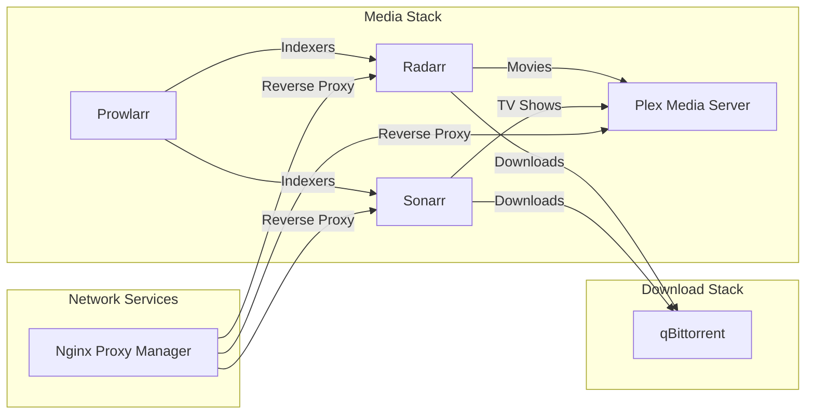

# Service Dependencies

## Dependency Graph

```mermaid
graph LR
    subgraph "Media Stack"
        Plex[Plex Media Server]
        Radarr[Radarr]
        Sonarr[Sonarr]
        Prowlarr[Prowlarr]
        
        Prowlarr -->|Indexers| Radarr
        Prowlarr -->|Indexers| Sonarr
        Radarr -->|Movies| Plex
        Sonarr -->|TV Shows| Plex
    end
    
    subgraph "Download Stack"
        qBittorrent[qBittorrent]
        Radarr -->|Downloads| qBittorrent
        Sonarr -->|Downloads| qBittorrent
    end
    
    subgraph "Network Services"
        NPM[Nginx Proxy Manager]
        NPM -->|Reverse Proxy| Plex
        NPM -->|Reverse Proxy| Radarr
        NPM -->|Reverse Proxy| Sonarr
    end
```

---
*Generated: 2025-07-31 14:23:17*