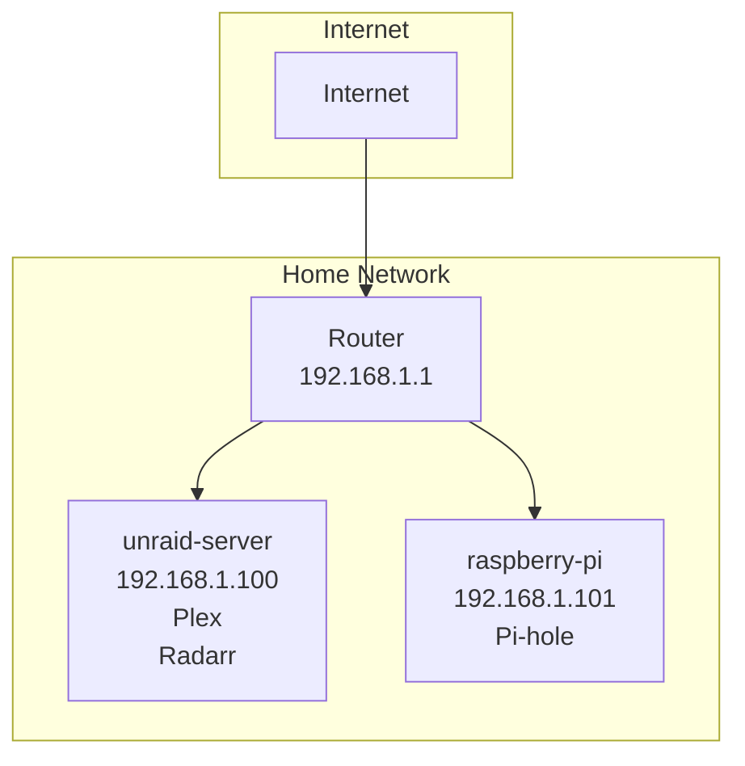

# Network Topology

## Network Diagram

## Host Details

| Hostname | IP Address | Services | Open Ports |
|----------|------------|----------|------------|
| unraid-server | 192.168.1.100 | Plex, Radarr | 32400, 7878 |
| raspberry-pi | 192.168.1.101 | Pi-hole | 80, 53 |

---
*Generated: 2025-07-31 14:23:17*